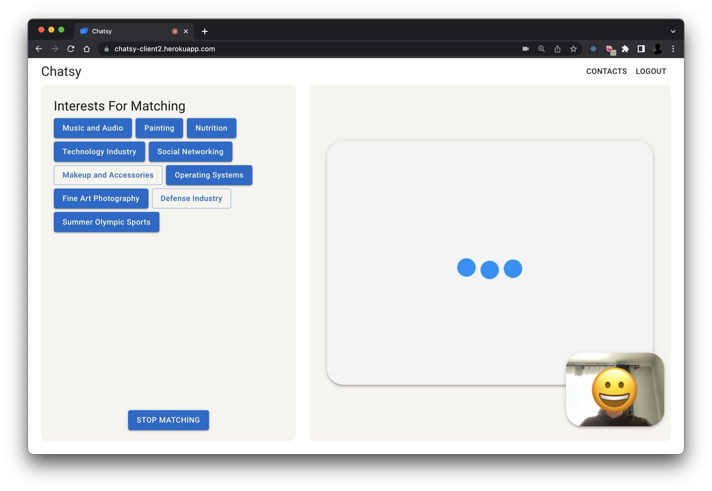
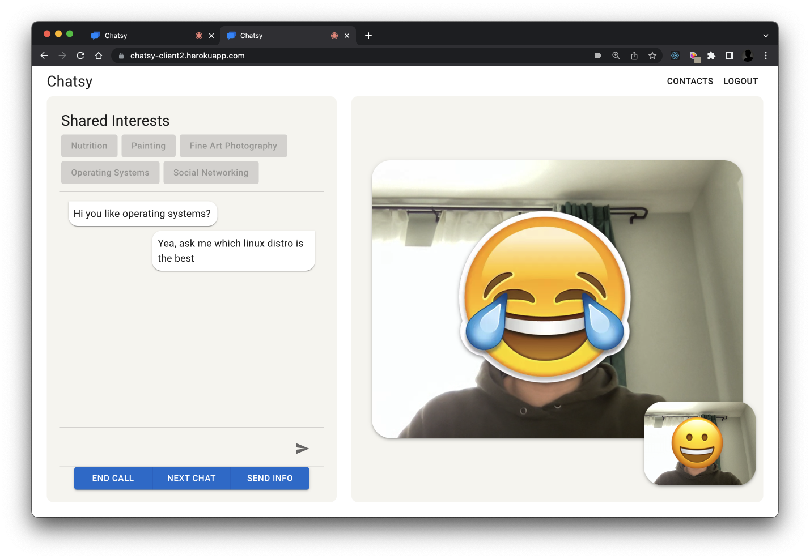

# Chatsy
A web application for enabling video and text chat between random users based on their interests.

## Authors
[Andrew Bradt](https://github.com/andrew-bradt), [Roy Liu](https://github.com/Roy7384)

## Screenshots

### Lobby

### Connected

### Logged Out

### Login

  

## Directions

[Visit the application](https://chatsy-client2.herokuapp.com/) and enter one of the following email addresses into the *Email Address* field and click *Sign In*:
  - rick.sandchez@gmail.com
  - lisa.simpson@gmail.com
  - link@yahoo.com
  - simon_bel123@mail.ca
  - all_might@academia.jp
  - mario@mushroomkindom.jp
  - test1@test.com
  - test2@test.com
  - test3@test.com

*Disclaimer: This app is hosted using free dynamos on Heroku and may be in a sleep state when you first navigate to the application or sign in. This may initially impact loading times at these stages.*

## Features
  - Logging in with a gmail account via Oauth 2.0
  - Automatically profile users by interest by leveraging Meaning Cloud's Natural Language Processing API
  - Utilize the Youtube Data API to obtain a keyword list from a user's liked videos to use as an input to the NLP API
  - Establish live stream and text sessions between users who have common interests
  - Toggling whether a particular interest will be used in the matching algorithm
  - Repeatedly attempting to connect users waiting in the lobby for a peer
  - Back-to-Back pairing capability when a connection ends between two users
  - Sending contact info to a connected peer and maintaining a history of received contact info during a session
  
## Future Features
  - Leverage more data API's to gain further insights of user interests
  - Group matchmaking
  - Make received contact info persistant
